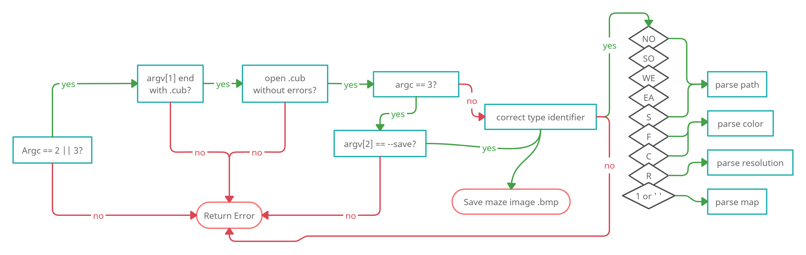

# cub3d
cause Doom was a milestone in my childhood

* [Introduction](#introduction)
* [Step by step](#step_by_step)
* [Mindmap](#mindmap) 
* [Study resources](#study)
* [Usage](#usage)

## introduction 
:suspect:

This [project](https://github.com/paulahemsi/cub3d/blob/main/en.subject.pdf) is inspired by the world-famous eponymous 90’s game, which was the first FPS ever. It will enable to explore ray-casting. My goal will be to make a dynamic view inside a maze, in which you’ll have to find your way

## step_by_step 
:hurtrealbad:

## day-by-day

inspired by L.R.Couto [Grumpy Robot](https://github.com/lrcouto) and some articles [like this one](https://hbr.org/2011/04/four-reasons-to-keep-a-work-di) from Teresa Amabile or [this one](https://medium.com/the-productivity-inn/how-to-maintain-a-work-diary-for-better-career-growth-eb543f97c34b) from Musa Mawanda.

>Keeping regular work diaries, which took no more than ten minutes a day, gave many of our research participants a new perspective on themselves as professionals and what they needed to improve.

  
Click to expand (:

* 16/03 and 17/03: watch this free [course](https://courses.pikuma.com/courses/raycasting) *Introduction to Raycasting Theory with JavaScript* from Pikuma
and this [coding challenge](https://www.youtube.com/watch?v=TOEi6T2mtHo) *2d Raycasting with p5js* from Coding Train

* 18/03: study collision detection and field of view algotithms. [more info](#study) and start to code a js prototype with p5.js library to understand better the concepts

* 19/03: coloquei a libft e inseri a ft_printf na libft, fazendo os ajustes de make file e headers necessários. Criei o makefile do Cub3d. Criei o header do cub3d com uma primeira organização de structs para as infos que vierem das configurações do arquivo .cub. Iniciei este diário de trabalho. Comecei a estudar as novas funções autorizadas:

* perror:

> The C library function void perror(const char *str) prints a descriptive error message to stderr. First the string str is printed, followed by a colon then a space.
[mais infos](https://www.tutorialspoint.com/c_standard_library/c_function_perror.htm)

* strerror: 

>The C library function char *strerror(int errnum) searches an internal array for the error number errnum and returns a pointer to an error message string. The error strings produced by strerror depend on the developing platform and compiler.
[mais infos](https://www.tutorialspoint.com/c_standard_library/c_function_strerror.htm)

* exit:

>The C library function void exit(int status) terminates the calling process immediately. Any open file descriptors belonging to the process are closed and any children of the process are inherited by process 1, init, and the process parent is sent a SIGCHLD signal.
[mais infos](https://www.tutorialspoint.com/c_standard_library/c_function_exit.htm)

Fiz a função main.c e o tratamento de erros para os argumentos do programa (arquivo .cub e flag --save). Iniciei o tratamento de erros para a cena do arquivo .cub, analisando os diferentes type identifiers nas possíveis ordens.

* 20/03: consegui fazer o [debugger do vscode funcionar no wsl](https://code.visualstudio.com/docs/cpp/launch-json-reference) com a ajuda de uma [extensão](https://code.visualstudio.com/docs/remote/wsl-tutorial). Iniciei um fluxograma do tratamento de erros.

*21/03: paths para texturas, resolution size e valor rgb floor e ceiling sendo salvos nas devidas structs. Falta lidar com o mapa e com duplicidades de configs.

## mindmap 
:goberserk:

## study 
## || further reading 
:finnadie:

* [Nothing To Hide's light explanation](https://ncase.me/sight-and-light/) by Nicky Case 
* [2d Raycasting coding challenge](https://www.youtube.com/watch?v=TOEi6T2mtHo) by Daniel Shiffman (Coding Train)
* [Ray Marching](https://www.youtube.com/watch?v=Cp5WWtMoeKg) by Sebastian Lague
* [Collision Detection book](http://www.jeffreythompson.org/collision-detection/) by Jeffrey Thompson
* [Symmetric Shadowcasting](https://www.albertford.com/shadowcasting/) by Albert Ford
* [Bresenham's line algorithm](https://en.wikipedia.org/wiki/Bresenham%27s_line_algorithm)
* [field of view algotithms overview](http://www.adammil.net/blog/v125_Roguelike_Vision_Algorithms.html) by Adam Milazzo
* [2d visibility article](https://www.redblobgames.com/articles/visibility/) by Red Blob Games
 
## usage 
:feelsgood:

