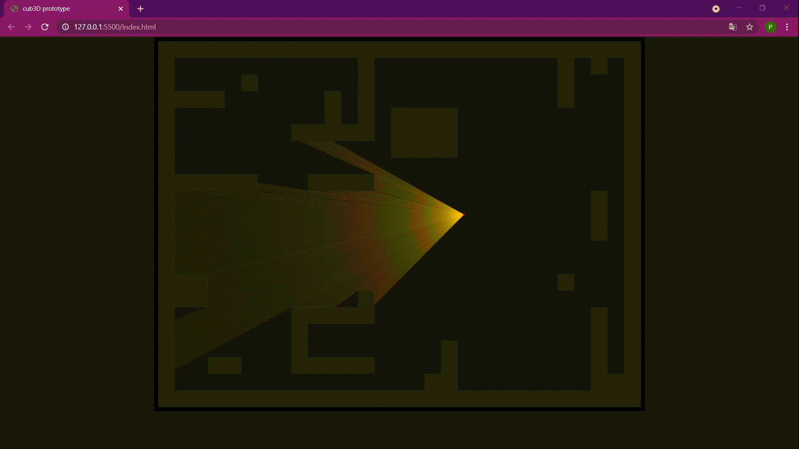
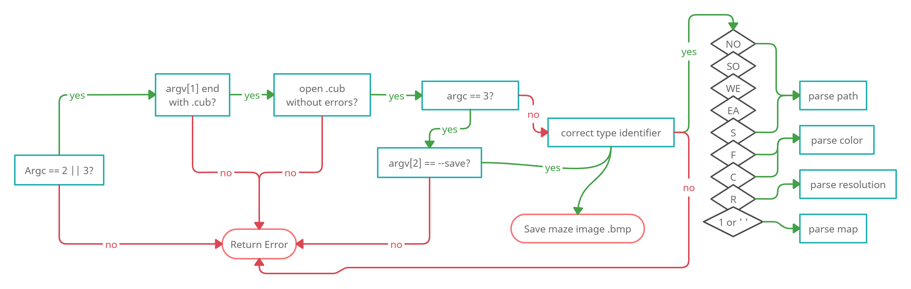
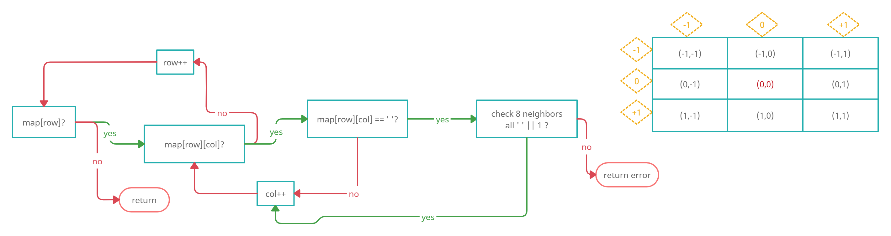
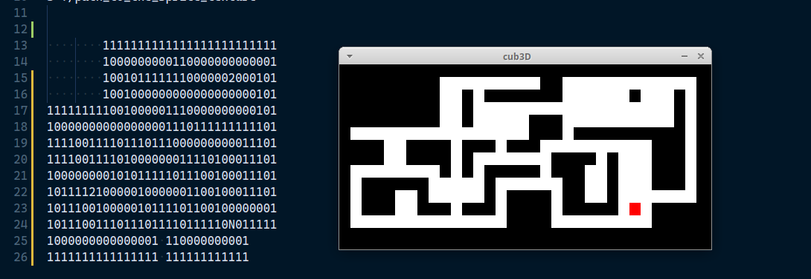
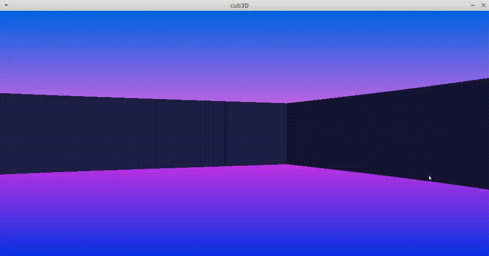
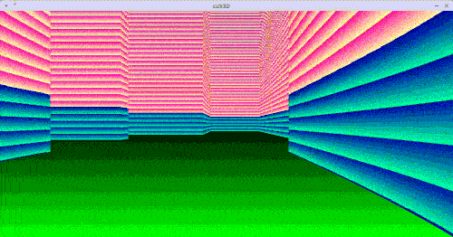

# cub3d
cause Doom was a milestone in my childhood

*in process*

* [Introduction](#introduction)
* [Step by step](#step_by_step)
* [Work Diary](#work_diary)
* [Mindmap](#mindmap) 
* [Study resources](#study_resources)
* [Usage](#usage)

## introduction 
:suspect:

This [project](https://github.com/paulahemsi/cub3d/blob/main/study_resources/en.subject.pdf) is inspired by the world-famous 90’s game [Wolfeinstein 3D](https://pt.wikipedia.org/wiki/Wolfenstein_3D), which was the first FPS ever. It will enable to explore ray-casting. My goal will be to make a dynamic view inside a maze, in which you’ll have to find your way

## step_by_step 
:hurtrealbad:

(time may overlap, like life and data)
* I watched videos and read about raycasting, field of view algorithms and collision detection to have an overall idea about the project. (~4 days)
* libraries adjustments, makefile and header file creation(~1 day)
* configuration parsing, which includes minimap storage and errors checking(~ 5 days)
* I struggled to make minilibx works in wsl (~2 days)
* I gave up the wsl and installed and ran minilibx in linux vm (~5 hours)
* geometry and minilibx library study (~2 days)
* I managed to draw the 2d minimap with mlx (~1 day)
* I got lost and completly stuck while trying to study(~4 days that seem an eternity)
* step by step list from raycasting process (~1 day)
* 3d wall renderization and wall colisions implementation (~5 days)
* fixing minor problems, adding bônus and extra features and implementing 'save bmp' (~4 days)
* Refactoring the code (~2 days)
* Implementing walls' textures (~4 days)

for more details, read the [work diary](#work_diary)

**raycasting steps:**

1. define wall size
2. define and get projection details:
  1. define camera's height
  2. define camera's field of view
  3. get camera's position
  4. get projection plane's dimension (window resolution)
  5. calculate camera's distance from projection plane
  6. calculate the angle between each ray that will be casted
  7. calculate the center point of projection plane
3. find walls
  1. subtract half FOV from camera's position
  2. cast a ray
    1. for horizontal and vertical:
      1.find first intersection with a grid boundary
      2. check if grid cell is a wall
      3. if it's not, calculate the step for the next's
      4. check each cell until find a wall
    2. save coordinates from the closest wall (horizontal or vertical)
    3. knowing the wall coordinates, calculate wall distance with Pitagoras theorem
    4. save wall distance with fish eye distortion correction
    7. repeat step 3.2 for all rays
5. draw walls
  1. for each wall:
    1.calculate projection wall height
    2. draw half of the height above the middle and half under the midle of the pixel column

## mindmap 
:goberserk:

## study_resources
:finnadie:

### raycasting
* [2d Raycasting coding challenge](https://www.youtube.com/watch?v=TOEi6T2mtHo) by Daniel Shiffman (Coding Train)
* [Bresenham's line algorithm](https://en.wikipedia.org/wiki/Bresenham%27s_line_algorithm)
* [Lode's raycasting walk through](https://lodev.org/cgtutor/raycasting.html) by Lode Vandevenne
* [digital differential analyzer (DDA) algorithm](https://www.geeksforgeeks.org/dda-line-generation-algorithm-computer-graphics/)
* [DDA line drawing algorithm video](https://www.youtube.com/watch?v=W5P8GlaEOSI)
* [Bresenham's line algorithm video](https://www.youtube.com/watch?v=RGB-wlatStc&t=202s)

### minilibx and computer graphics
* [minilibx-linux version](https://github.com/42Paris/minilibx-linux)
* [minilibx quick overview](https://github.com/qst0/ft_libgfx/blob/master/man_mlx.md)
* [minilibx guide](https://harm-smits.github.io/42docs/libs/minilibx) by Harm-Smits
* [mlx images](https://github.com/keuhdall/images_example/blob/master/README.md)
* [computer graphics from scratch](https://www.scratchapixel.com/)
* [math.h](https://www.tutorialspoint.com/c_standard_library/math_h.htm)
* [keysymdef.h -keycodes for linux](https://cgit.freedesktop.org/xorg/proto/x11proto/tree/keysymdef.h)
 
### virtual machine
* [vscode settings sync video](https://www.youtube.com/watch?v=f-uzUsHTQ8s) by James Q Quick

### further_reading
* [Nothing To Hide's light explanation](https://ncase.me/sight-and-light/) by Nicky Case 
* [Ray Marching](https://www.youtube.com/watch?v=Cp5WWtMoeKg) by Sebastian Lague
* [Collision Detection book](http://www.jeffreythompson.org/collision-detection/) by Jeffrey Thompson
* [Symmetric Shadowcasting](https://www.albertford.com/shadowcasting/) by Albert Ford
* [field of view algotithms overview](http://www.adammil.net/blog/v125_Roguelike_Vision_Algorithms.html) by Adam Milazzo
* [2d visibility article](https://www.redblobgames.com/articles/visibility/) by Red Blob Games
* [random walker to make a procedural dungeon map](https://www.freecodecamp.org/news/how-to-make-your-own-procedural-dungeon-map-generator-using-the-random-walk-algorithm-e0085c8aa9a/) by Ahmad Abdolsaheb
* [John Carmack tech talk](https://www.youtube.com/watch?v=lHLpKzUxjGk)

## usage 
:feelsgood:

`git clone git@github.com:paulahemsi/cub3d.git`

`cd cub3D`

`make`

`./cub3D path_to_scene_file.txt`

you may edit all these settings:

resolution, ceiling and floor colors (range 0 - 255), walls and sprite textures, map. The map must be sorrounded by walls(1) and have the initial player position and direction (W- west, E- east, N-north, S-south)

```
R width height
C red green blue
F red green blue

SO ./path_to_south_texture.xpm
NO ./path_to_north_texture.xpm
EA ./path_to_east_texture.xpm
WE ./path_to_west_texture.xpm
S ./path_to_the_sprite_texture.xpm

11111
10001
10201
100W1
11111
```

key  | function |
---|------|
left/right arrow | turn				|
wasd | move					|
shift | run				|
tab | toggle minimap	|
g | toggle background gradient				|
b | toggle debug colors				|
n | toggle night vision				|
p | save .bmp screenshot				|
r | always running mode on		|


## work_diary

inspired by L.R.Couto [Grumpy Robot](https://github.com/lrcouto) and some articles [like this one](https://hbr.org/2011/04/four-reasons-to-keep-a-work-di) from Teresa Amabile or [this one](https://medium.com/the-productivity-inn/how-to-maintain-a-work-diary-for-better-career-growth-eb543f97c34b) from Musa Mawanda.

>Keeping regular work diaries, which took no more than ten minutes a day, gave many of our research participants a new perspective on themselves as professionals and what they needed to improve.

<details>
  <summary>Click to expand (:</summary>

* 16/03 and 17/03: I watched this free [course](https://courses.pikuma.com/courses/raycasting) *Introduction to Raycasting Theory with JavaScript* from Pikuma
and this [coding challenge](https://www.youtube.com/watch?v=TOEi6T2mtHo) *2d Raycasting with p5js* from Coding Train

* 18/03: I studied collision detection and field of view algotithms. [more info](#study) and start to code a js prototype with p5.js library to understand the concepts better



* 19/03: I inserted ft_printf in libft and libft in cub project, making the necessaries adjustments. I created makefile with some rules (including a test rule with -fsanitize flag to check leaks during the process). I created cub3d header with a first struct organization to keep the informations from the .cub configuration file. I began this work diary and I started to study those new authorized functions:

* perror:

> The C library function void perror(const char *str) prints a descriptive error message to stderr. First the string str is printed, followed by a colon then a space.
[mais infos](https://www.tutorialspoint.com/c_standard_library/c_function_perror.htm)

* strerror: 

>The C library function char *strerror(int errnum) searches an internal array for the error number errnum and returns a pointer to an error message string. The error strings produced by strerror depend on the developing platform and compiler.
[mais infos](https://www.tutorialspoint.com/c_standard_library/c_function_strerror.htm)

* exit:

>The C library function void exit(int status) terminates the calling process immediately. Any open file descriptors belonging to the process are closed and any children of the process are inherited by process 1, init, and the process parent is sent a SIGCHLD signal.
[mais infos](https://www.tutorialspoint.com/c_standard_library/c_function_exit.htm)

I made main.c function and error handling for program arguments (.cub and flag --save). I began the error handling in the scene from the .cub file, parsing the possibles type identifiers.

* 20/03: I manage to adjust [vscode debugger for wsl](https://code.visualstudio.com/docs/cpp/launch-json-reference) thanks to [this extension](https://code.visualstudio.com/docs/remote/wsl-tutorial). I began a error handling mindmap.



* 21/03: I manage to save textures paths and resolution, floor and ceiling values in theyer own variables (inside configs struct).
I still need to deal with the map and double configs.

* 22/03: Paths duplicicty problem solved! It was easier than I've imagined, I'm very glad with this path function =) I realised that resolution and color duplicity was already solved because of the function logic. yey!

* 23/03: I finished map and walls errors handling. Map correctly stored in a 2d array.

* 24/03: I included minilibx but I'm struggling to create a window with it. May be is an Wsl issue :/



* 25/03: I gave up wsl and started working on the vm. The window with mlx was created and I managed to render some pixels and lines (yey!). I started to study geometry in computer graphics

> linear algebra is a branch of mathematics that has to do with the study of vectors. 

>A vector can be represented as an array of numbers. This array of numbers, which can assume any desired length, is also sometimes called a tuple in mathematics.

>Here, a point is a position in a three-dimensional space. A vector, on the other hand, usually means a direction (and some corresponding magnitude, or size) in three-dimensional space. Vectors can be thought of as arrows pointing various directions.

Player position and player orientation are now been saved in the configs struct, I bet it will be very important in the future.

* 26/03: I studied minilibx man pages and function. I was able to make a color gradient playing with rgb values in some kind of loop and...: the minimap is now being rendered! =D 
I'm still not sure if it will be better to render it in another window or in the same one.



* 27/03: The code was refactored and the player now answer to `w a s d` keys to walk in the minimap (in the wrong way, though).

* 29/03: I fixed some of the walking problems, now the player moves when the key is pressed (not released). Minilibx study still going on. I should probably go back to the maths in the next days. I'm also trying to understand which flow the program should have from now on.

* 30/03: I started a mindmap from the flow I will need to take to continue the program and also studied DDA and Bresenham's line drawing algorithm. I'll probably use Bresenham's, it is more complex to understand but aparently much more efficient and accurate.

* 31/03: I implemented Bresenham's algorithm to put lines and watched tons of raycasting videos on youtube. Still trying to figure what will be the best approach from now on.

* 1/04: I've just realized that something went wrong with Bresenham's implementation. Trying to fix it. Hours later: done! Now the player has a line pointing at the direction and walks acordly.

* 2/04: after days of struggling, I finally managed to make a list from the steps the raycast requires. Thanks to this [wonderfull resource](https://permadi.com/1996/05/ray-casting-tutorial-table-of-contents/) by F. Permadi. I started to implement horizontal colision checking for the first ray.

* 5/04: Bresenham's algorithm is finally working properly, so I managed to make the gradient background. Minimap has now transparent background and is toggled by the alt key.

* 6/04: Player is moving and turning accordingly. Wall collisions aren't working precisely yet.

* 7/04: *wall_collisions* 7 vs 1 *paula*

* 8/04: *wall_collisions* 8 vs 5 *paula*

* 9/04: Every dog has its day. Not only the wall collisions are working (99%), but also the walls are beeing rendered! **And** running/walking is implemented! 
I also implemented invisibility and crouching, but the result got a little bit awkward, so I took them off for now.



* 10/04: I should have worked on the walls' textures, but I polished the gradients instead. The walls are still with solid color, but now the program knows how to make a nice gradient with whatever input of ceiling and floor colors the users chooses. The player is walking like a crab as it should with `a` and `d` keys. Simple shadow effect on the walls implemented.

* 11/04: I implemented debug colors, that can be toggled with the `b` key :)

* 12/04: I'm still procrastinating a bit, avoiding facing the textures and the bmp save, so I implemented secret doors instead. As they are secret, it's hard to see while testing, so I polished a bit the debug colors to also show those new invisible doors. In the minimap, though, is too easy to discover some of the secrets, so maybe it would be a nice touch to have a map item that unlocks the minimap access. Late in the night, finally the bmp image is being saved when the flag --save is used. I also implemented a print screen key (`p`), so the player can save a screenshot at any moment.

* 13/04: Walls' bug fixed, now the rays know the correct collisions direction even in the tricky interseccions. Night vision implemented.

* 14/04: I started to study the textures implementation, but then I realized I need to change some thinks in my structs. Therefore, I'm refactoring the whole code, beggining with a reorganization of all the structs. Is getting much better, but it's a lot of work.

* 15/04: New structs are implemented

* 16/04: The walls' textures are melting my brain

* 17/04: Bugs are beautiful



* 18/04: Oh my! The walls' textures are there! They have some issues? Yes. But they are there!

* 19/04: All libft's functions are now in the new norme v3, and I've realised that some of the walls issues was just a matter of adjusting the size of the images (they must have 64 x 64).

* 20/04: I started to deal with the sprites. Sprites' positions are being saved, but the sprite renderization is still a mess. The walls' textures are now being render accordingly with the direction that's facing (4 patterns, one for each direction).

* 21/04: I spent the hole day working on the sprites and in the end needed to go back to my last git commit 'cause nothing worked. Mug.

* 22/04: Still in the sprite's swamp

* 23/04: I gave myself a break from the mindblowing sprites and spent the day reviewing the code and adjusting to the norm

* 24/04: Same as yesterday

* 25/04: The bug that made the player sometimes look through the walls and see the horizont is fixed. 

* 26/04: I gave myself until thursday to put the sprites in the game. Big achievement today: the pink square that represents my sprites for now is in the same position in the map, without follow the player's view as before.
I also implemented a "always running" key (`r`), very usefull when the player (or the programmer) is without patience to walk slow, and started to use my breaks from coding to draw a hud for the game. I started drawing a little girl (the main character) and some hearts for the life bar. Hearts are harder to draw than I thougth.

* 27/04: Another day of hope! The sprites are being render on the map! They are full of bugs? Yes, but is a huge step anyway :)
I also finally fix a bug that was making the program crash once in a while. The problem was in my raycasting function, I was checking if the tile was free and if not, I was supposing that the tile should be a wall and saved the hit, but apparently there's some other possible cases, so I changed the function and now I check if has a wall in the tile first, and if it isn't, I increment to continue my wall search.
Less but not least, I drawed more elements to the hud: night vision glasses, map, keys and a skull version of the character.

* 28/04: I need to say: I just love the bugs! I wish I had written what I did to make them and use them in the game! Well, better late than ever, today I wrote down my new bug to make a dizzy effect.

</details>

